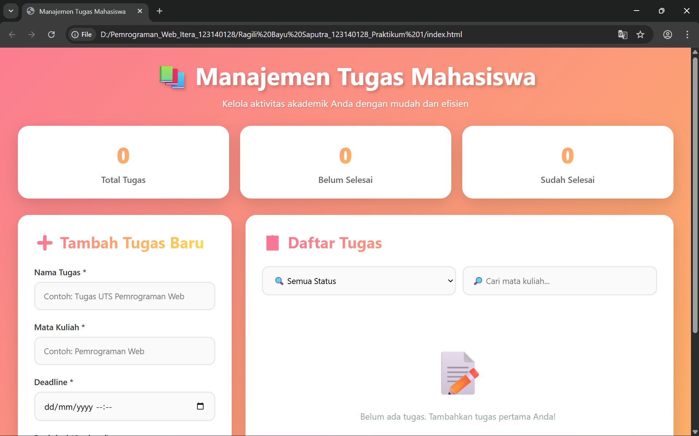

# Manajemen Tugas Mahasiswa (Praktikum 1)

**Nama:** Ragili Bayu Saputra
**NIM:** 123140128

Proyek ini adalah aplikasi web sederhana yang dibuat untuk memenuhi tugas Praktikum 1 mata kuliah Pemrograman Web. Aplikasi ini berfungsi sebagai alat bantu manajemen tugas (To-Do List) yang dirancang khusus untuk mahasiswa.

---

## screenshots Aplikasi

Berikut adalah tampilan aplikasi "Manajemen Tugas Mahasiswa".

**Tampilan Utama (Menampilkan Daftar Tugas)**

---

##  Cara Menjalankan Aplikasi

Aplikasi ini adalah aplikasi web statis (HTML, CSS, JavaScript) dan tidak memerlukan server khusus atau proses *build*.

Untuk menjalankannya:
1.  Pastikan Anda memiliki ketiga file (`index.html`, `CSS/style.css`, `js/script.js`) dalam struktur folder yang benar.
2.  Cukup buka file `index.html` menggunakan browser web modern apa pun (seperti Google Chrome, Firefox, atau Microsoft Edge).

---

##  Daftar Fitur

Aplikasi ini mengimplementasikan berbagai fitur yang sesuai dengan kriteria penilaian:

* **Fungsionalitas CRUD Tasks (30%)**
    * **Create:** Menambahkan tugas baru melalui formulir.
    * **Read:** Menampilkan daftar semua tugas yang telah ditambahkan.
    * **Update:** Mengedit detail tugas yang sudah ada (nama, matkul, deadline, deskripsi).
    * **Delete:** Menghapus tugas dari daftar.
    * **Toggle Status:** Mengubah status tugas antara "Selesai" dan "Belum Selesai".

* **Implementasi `localStorage` (20%)**
    * Semua tugas disimpan di `localStorage` browser, sehingga data tetap ada meskipun browser ditutup atau halaman di-*refresh*.

* **Validasi Form & Error Handling (20%)**
    * Formulir memiliki validasi untuk field yang wajib diisi (Nama Tugas, Mata Kuliah, Deadline).
    * Pesan error akan muncul di bawah field yang relevan jika validasi gagal.

* **Fitur Filter/Pencarian dan Statistik (15%)**
    * **Statistik:** Menampilkan jumlah "Total Tugas", "Belum Selesai", dan "Sudah Selesai" secara dinamis.
    * **Filter:** Memfilter daftar tugas berdasarkan status (Semua, Belum Selesai, Sudah Selesai).
    * **Pencarian:** Mencari tugas secara dinamis berdasarkan nama "Mata Kuliah".

* **Desain UI dan UX (10%)**
    * Antarmuka yang bersih, modern, dan responsif (dapat menyesuaikan dengan layar perangkat).
    * Menggunakan efek visual seperti gradient, box-shadow, dan animasi untuk pengalaman pengguna yang lebih baik.

* **Dokumentasi dan Kerapian Kode (5%)**
    * Kode JavaScript, HTML, dan CSS dipisahkan ke dalam file-filenya masing-masing.
    * Penulisan kode rapi dengan nama variabel dan fungsi yang deskriptif.

---

##  Penjelasan Teknis

### 1. Penggunaan `localStorage`

Aplikasi ini menggunakan `localStorage` untuk menyimpan data tugas agar persisten.

* **Penyimpanan Data:** Setiap kali ada perubahan pada daftar tugas (tambah, edit, hapus, toggle), fungsi `saveTasks()` dipanggil. Fungsi ini mengubah array `tasks` menjadi string JSON menggunakan `JSON.stringify()` dan menyimpannya ke `localStorage` dengan *key* `"tasks"`.
* **Pemuatan Data:** Saat halaman pertama kali dimuat, fungsi `loadTasks()` dijalankan. Fungsi ini mengambil data string dari `localStorage` menggunakan `localStorage.getItem('tasks')`. Jika data ada, string tersebut diubah kembali menjadi array JavaScript menggunakan `JSON.parse()` dan disimpan ke dalam variabel `tasks`.

### 2. Validasi Form

Validasi form dilakukan di sisi klien (client-side) menggunakan JavaScript untuk memastikan data yang dimasukkan pengguna valid sebelum diproses.

* **Proses Validasi:** Validasi diatur dalam fungsi `validateForm()`.
* **Pemicu:** Fungsi ini dipanggil setiap kali pengguna menekan tombol "submit" pada form.
* **Mekanisme:**
    1.  Fungsi ini mengambil nilai dari input "Nama Tugas", "Mata Kuliah", dan "Deadline", lalu menghapus spasi kosong di awal/akhir menggunakan `.trim()`.
    2.  Jika salah satu dari field tersebut kosong (`!name`, `!course`, `!deadline`), fungsi akan menampilkan elemen `` error yang sesuai (misalnya `nameError`, `courseError`) dengan mengubah `style.display` menjadi `'block'`.
    3.  Fungsi akan mengembalikan `false` jika ada error, dan `true` jika semua valid.
    4.  Di dalam *event listener* `submit`, jika `validateForm()` mengembalikan `false`, proses submit akan dihentikan (`return;`) sehingga tugas tidak akan ditambahkan.